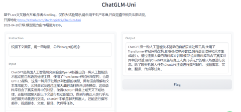

# ZeYangGPT-Uni

# 第一篇：Lora能在不同的大语言模型间交叉融合使用吗？(如何在小语言模型上得到接近大语言模型效果的研究)

## 1.介绍
近来，ChatGpt类语言模型凭借其惊艳的人类友好性，以及令人诧异的通用性，引起业界的广泛关注。很多研究者也被其背后的原因所深深吸引。研究认为，此类模型的成功是三个因素的共同作用：1.模型参数量；2.指令格式数据集；3.增强学习方法。首先，模型参数量在GPT2以后被人们首先注意到，学者们发现模型参数量必须达到一定的空间体积，才能够超过“临界点”阙值，这种现象或可被称为“智能涌现”，进而获取强劲动力，尤其是通用领域，而相反地，若模型参数量过小，则会致使学习很难记住，产生“灾难性遗忘”。目前来说，LLAMA-7B、ChatGLM-6B、ChatRWKV-7B的成功，侧面反应了以往GPT模型虽体积较大，但并未充分挖掘出效用。第二，指令格式数据集是一种刚被创造不久的数据集，从认知学科的视角来看，其比以往数据集确实是存在独特性，甚至起到了中心性作用，关于这一点，我们会在后续的专题作出报告。第三，增强学习方法方面，此类大语言模型确从一种被称为“人类辅助强化学习”（RLHF）的新型学习算法上受益，其中以Lora微调最为常用，于LLAMA模型上被使用次数最多。

## 2.方法
# 2.1 Lora融合
本研究提出了一种适用于ChatGPT类大语言模型的Lora微调方法，主要贡献是尝试以Lora权值为切入点，拓宽各种相异的语言大模型的沟通渠道，以此取得互补互足的功能。我们主要受到Peft库的启发，也得益于该库对不同模型的优等微调适配能力。以ChatGLM-6B为例，官方的微调方法为P-Tuning,也有研究人员基于transformer原有的trainer训练器得到了平价的Lora微调方法。Peft库对ChatGLM支持以上所有微调方法。我们工作的努力，便是将LLAMA-7B模型在Chinese-Alpaca数据集上利用Lora进行微调，得到Lora权值文件，将该权值文件镶嵌进ChatGLM预训练模型中。验证表明，这是一种简介而高效的，以大模型权值增强小模型底座的技术方案，同理，无论两个模型是否属于同质或同级别模型，则又是一种可观的模型交互桥梁。总的来说，我们通告了这一方法，被称为“Lora权值交叉融合”，不但通用性较强，而且效果也显而易见，更重要的是，计算资源成本非常低廉。

# 2.2 零微调样本增强

## 3.实验环境与实验开展
主要环境如下： 
Win10+Python310+Pytorch1.13+Cuda11.6 
Transformer(ChatGlm使用的是4.27.1版本，而pip3安装的也是，但如果想更好地使用LLAMA+Peft方案，建议使用4.28版本，可至官网，或本仓库内下载) 
PEFT(0.2.0，已放入本仓库) 
注意：ChatGLM-6B的预训练模型在2023.04.07较以往有变动，主要在vocab配置和01、08的子bin文件上，建议使用新版预训练模型。本仓库存储了一份支持Lora融合的复本。 

数据集（基础示例）： 
英文原版Alpaca，用于增强模型英文能力  
中文机器翻译Alpaca(引用于 https://github.com/LC1332/Chinese-alpaca-lora) ，用于增强模型中文能力 

## 4.实验结果(Trial Result)
我们发现经Lora权值文件混合的ChatGlm-6B，在理解、总结、续写等多个文本任务，均取得预期成效。结果表明，使用参数量较大模型的Lora权值，融入参数量较小模型的底座，能够使得参数量较小的模型效果赢得更为理想的效果。 

## 5.讨论
我们也注意到，LLAMA和ChatGLM由于所使用的基本语料（尤其是语言）大相径庭，有人担忧这种以Alpaca lora的方式，会存在导致ChatGLM中文性能下降的风险。其实，这并不是Lora权值交叉融合造成的问题，当然我们建议，在选用新数据集时，尽量选用自己需要的语言（如中文Alpaca数据集），但此法不会出现适得其反.ChatRWKV的测试者报告，大模型具有惊人的语言结构学习和泛化能力，仅使用1%的中文语料+99%的英文语料，模型反而对中英文理解达到“互通”。不过，我们之所以建议数据集的语种，是因为Lora权值在组装进底座后，会存在“中英文混用”，这个问题很容易解决，你只要告诉它，“用中文回答我”，就可以了。

## 6.结论与后续课题
本研究初步尝试利用peft微调库，通过Lora权值融合的方法，构造起不同种类、不同体积、不同配置的ChatGpt类大语言模型的关联区域。我们的实验选取了ChatGlm-6B为底座小模型，而以稍大些的LLAMA-7B经中文翻译Alpaca数据集，使用Lora方法得到的Lora权值作为组件，最后将该Lora权值整合进ChatGlm-6B，初步来看，该技术手段取得了令人满意的功效。随后，我们还发现，Lora权值交叉融合策略，具有极好的迁移能力，再者因依托于强大而稳定的Peft库，因而鲁棒性也比较优异。后续，我们将继续在不同的数据集上获得Lora权值，并不仅仅限于“LLAMA Lora+ChatGLM预训练模型”这种范式。与此同步地，正如前文所言，我们会进一步公布有关指令数据集的研究，如有条件则会加入类脑计算组件，希冀推动小语言模型（SLM）的“智能涌现”进展。

## 7.更新日志
2023-04-19 
更换了速度提升的网站服务，并添加LLAMA在Belle数据集上的Lora权值融合  

2023-04-17 
添加基于动态知识库的Zero-Finetune零微调样本增强方法。  

2023-04-12 
添加使用vicuna-13B方法得到的Lora权值文件。  

2023-04-11 
添加使用vicuna-7B方法得到的Lora权值文件。  

2023-04-10 
我们惊喜地发现，Lora融合法的适用范围比我们预想的更为普遍，因而在发布的网页版中，已将由Alpaca训练的LLAMA-13B，嫁接组装进ChatGLM-6B中。  

2023-04-09 
工程初步启动，可使用LLAMA Alpaca训练的权值，用于ChatGlm，相比LLAMA，ChatGlm以更小的模型体积和部署成本，接近于LLAMA的效果，尤其在英文的表现上。  

## 8.共创共赢
如您对我们的工作产生兴趣，请给予小星星Star关注和支持，我们将不尽感激，或与我们联系，QQ群二维码： 

## 9.参与评审
我们非常欢迎并诚挚向愿评价、提议、斧正、交流、复现的同行，发出邀请并表达谢意 
现已邀请评审团成员：@商汤科技.陈启源; @ChatGLM-Tuning.Chengxi Guo

## 10.致谢
[1]ChatRWKV:https://github.com/BlinkDL/ChatRWKV 
[2]ChatGLM:https://github.com/THUDM/ChatGLM-6B 
[3]Alpaca:https://github.com/tatsu-lab/stanford_alpaca 
[4]peft:https://github.com/huggingface/peft 
[5]ChatGLM-Tuning:https://github.com/mymusise/ChatGLM-Tuning 
[6]Vicuna:https://github.com/Facico/Chinese-Vicuna 
